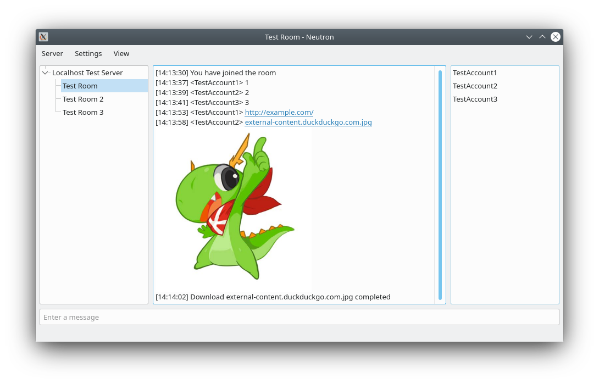
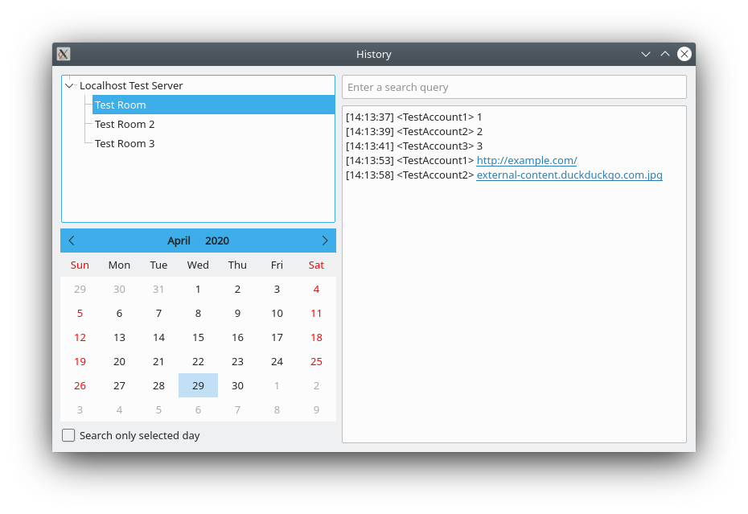

# Neutron Desktop


Free open source client, written in C++ / Qt

## Disclaimer

This project was created for educational purposes. Not recommended for everyday use.

## Features

- Instant messaging
- Rooms
- File sharing
- Offline messages
- Message history
- Connection via proxy

## Build instructions
1. Install required components:
- [Qt](https://www.qt.io/)
- [Crypto++](https://github.com/weidai11/cryptopp)
- [liboqs](https://github.com/open-quantum-safe/liboqs)
- [extra-cmake-modules](https://github.com/KDE/extra-cmake-modules)
- [KConfigWidgets](https://cgit.kde.org/kconfigwidgets.git)

2. Get the source:
```
git clone https://github.com/gadoofou87/neutron-desktop
cd neutron-desktop
```
and build:
```
mkdir build && cd build
cmake ..
cmake --build . --target all
```

## Screenshots



